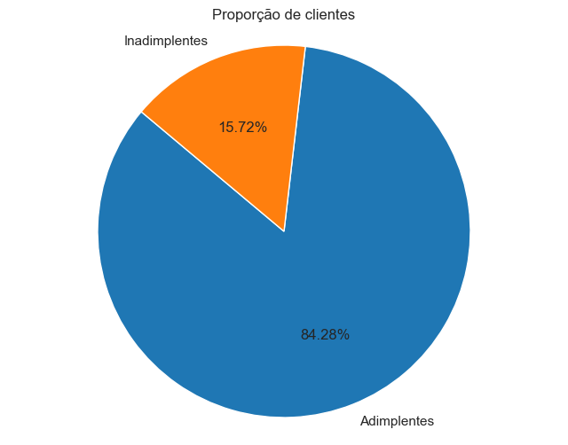

# **Conclusões**

As conclusões apresentadas a seguir derivam de uma análise detalhada dos dados fornecidos, que foram explorados e examinados com o objetivo de entender os padrões e tendências relacionados à inadimplência dos clientes. É importante ressaltar que essas conclusões refletem apenas os resultados obtidos a partir da análise do banco de dados disponível e não devem ser interpretadas como indicadores de total causalidade. Embora forneçam insights valiosos sobre os fatores associados à inadimplência, outras variáveis e fatores externos podem influenciar os resultados observados. Portanto, essas conclusões devem ser consideradas como parte de um quadro mais amplo e sujeitas a investigações adicionais e análises aprofundadas.

- Ao analisar as variáveis categóricas (Escolaridade, Estado Civil, Salário Anual e Limite do Cartão), não foi possível identificar nenhum padrão que justificasse a inadimplência dos clientes.

- Observou-se uma tendência de aumento do número de meses de relacionamento à medida que a idade dos clientes aumenta. Isso sugere que clientes com mais idade tendem a ter um relacionamento mais longo com a empresa.

- Verificou-se uma tendência de inadimplência entre os clientes com até 30 anos de idade e menos de 40 meses de relacionamento com a instituição financeira.

- Ao analisar as quantidades de transações nos últimos 12 meses, percebemos que os clientes que realizaram entre 20 e 60 transações tendem a se tornar inadimplentes.

- A análise dos valores de transações nos últimos 12 meses indicou que os clientes com transações entre R$ 1.000 e R$ 3.000 estão mais propensos à inadimplência.

- Notou-se que a maioria dos clientes com 60 a 80 transações no último ano e um valor de transações entre R$ 7.500 e R$ 10.000 são inadimplentes.

- Por outro lado, clientes com mais de 100 transações no último ano e com valores de transações superiores a R$ 12.000 não indicam nenhum sinal de inadimplência.

